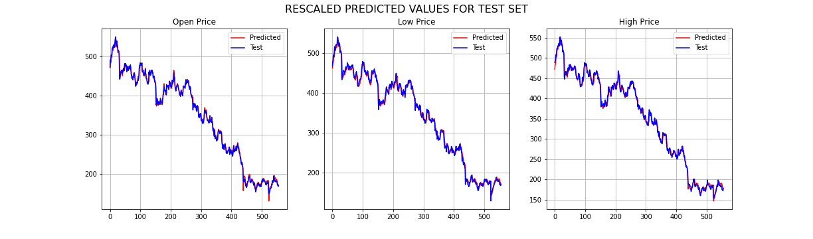

# NNFL-Design-Project-2020

## PROJECT PAPER
This is the [link](https://link.springer.com/article/10.1007/s13042-019-01041-1) to the paper.

## PROJECT PRESENTATION
This is the [project presentation](https://github.com/niravbhandari2000/NNFL-Design-Project-2020/blob/master/NNFL%20Project%20Presentation.pdf).

## MODEL FILES
The [Main Model](https://github.com/niravbhandari2000/NNFL-Design-Project-2020/blob/master/ADRNN_Model_Final.ipynb)
is the Associated Deep Recurrent Neural Network model which predicts Open Price, Low Price and High Price of a Stock.
The [LSTM Model](https://github.com/niravbhandari2000/NNFL-Design-Project-2020/blob/master/LSTM_model_for_comparision.ipynb)
and 
[DRNN Model](https://github.com/niravbhandari2000/NNFL-Design-Project-2020/blob/master/DRNN_model_for_comparision.ipynb)
are other existing models which are used for comparison against the main model.

The main model uses value predicted by one network as an input to another network as shown in the figure below.

## DATA
The data files are the stock data which can be downloaded from [nseindia.com.](https://www1.nseindia.com/products/content/equities/equities/eq_security.htm)
We have arbitrarily taken Tata Motors (ISIN: INE155A01022) stock prices. The files are available in year wise data. We have concatenated 15 years of data [here](https://github.com/niravbhandari2000/NNFL-Design-Project-2020/blob/master/tata_dataset.csv). The user may take any other stock price as well.
## INSTRUCTIONS TO RUN THE PYTHON FILE:
1) To run any file, please open it with google colab, whose link is provided in the github repository itself. 
2) You will have to upload the
[tata_dataset.csv](https://github.com/niravbhandari2000/NNFL-Design-Project-2020/blob/master/tata_dataset.csv)
file while running the command in the sixth code block 'uploaded = files.upload()'. This will upload the 
   the dataset to the file.
3) After this all the files will run smoothly.

## PREDICTION BY THE FINAL MODEL

It is evident from the graph that the model works accurately. 

This was compared with the existing models, and result was as follows:- 

|        |	         |    ADRNN  |           |	         |  DRNN     |           |	         |  LSTM     |           |
| ------ | --------- | --------- | --------- | --------- | --------- | --------- | --------- | --------- | --------- |
| Epochs |	OP       |	LP       |	HP       |	OP       |	LP       |	HP       |	OP       |	LP       |	HP       |
| 20     |	2.00E-05 |	4.00E-05 |	3.00E-05 |	5.00E-05 |	7.00E-05 |	5.00E-05 |	9.00E-05 |	1.50E-04 |	8.00E-05 |
| 40     |	2.00E-05 |	4.00E-05 |	2.00E-05 |	2.00E-05 |	5.00E-05 |	4.00E-05 |	4.00E-05 |	7.00E-05 |	4.00E-05 |
| 60     |	1.37E-05 |	4.00E-05 |	2.00E-05 |	2.00E-05 |	4.00E-05 |	3.00E-05 |	2.00E-05 |	5.00E-05 |	3.00E-05 |
